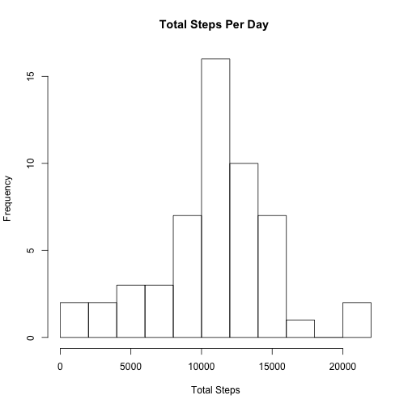
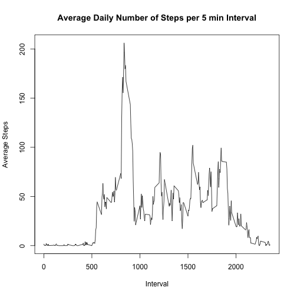
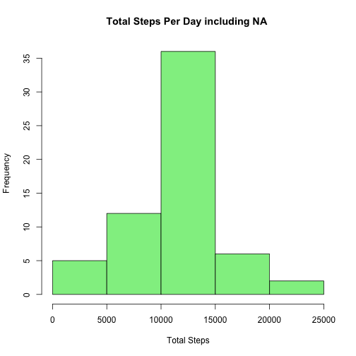
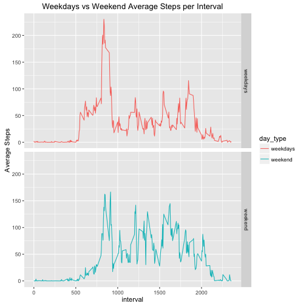

## Introduction

This assignment makes use of data from a personal activity monitoring device. This device collects data at 5 minute intervals through out the day. The data consists of two months of data from an anonymous individual collected during the months of October and November, 2012 and include the number of steps taken in 5 minute intervals each day.

The data for this assignment can be downloaded from the course web site:

* Dataset: [Activity monitoring data](https://d396qusza40orc.cloudfront.net)[52K]


The variables included in this dataset are:

* steps: Number of steps taking in a 5-minute interval (missing values are coded as NA)
* date: The date on which the measurement was taken in YYYY-MM-DD format
* interval: Identifier for the 5-minute interval in which measurement was taken

The dataset is stored in a comma-separated-value (CSV) file and there are a total of 17,568 observations in this dataset.

## Reading The Dataset
Data read using read.csv function since the data downloaded as csv file.


```r
data1 <- read.csv("activity.csv")
summary(data1)
```

```
##      steps                date          interval     
##  Min.   :  0.00   2012-10-01:  288   Min.   :   0.0  
##  1st Qu.:  0.00   2012-10-02:  288   1st Qu.: 588.8  
##  Median :  0.00   2012-10-03:  288   Median :1177.5  
##  Mean   : 37.38   2012-10-04:  288   Mean   :1177.5  
##  3rd Qu.: 12.00   2012-10-05:  288   3rd Qu.:1766.2  
##  Max.   :806.00   2012-10-06:  288   Max.   :2355.0  
##  NA's   :2304     (Other)   :15840
```

## Processing The Data
The dplyr and base packages were used to analyze data. The ggplot2 and base plot package were used to visualization of analyzed data.


```r
library(dplyr)
library(base)
library(ggplot2)
```
#### Histogram of the total number of steps taken each day
First step was to remove all the rows with NA. Then used group_by function on date to make a new column with total number of steps per day. Finally, selected unique row of date column. Also, this could be done with summarise function.

```r
# Remove NA rows
d1 <- data1[complete.cases(data1), ]

# Subsetting data frame d1
d2 <- d1 %>%
  group_by(date) %>%
  mutate(TotalSteps = sum(steps))

# Select unique rows of date columns of d2
d3 <- select(d2, date, TotalSteps) %>%
  unique()
```

#### Create Histogram


```r
# Create histogram of Total Steps
hist(d3$TotalSteps, breaks = 10, main ="Total Steps Per Day ", xlab = "Total Steps")
```



#### Mean and median number of steps taken each day


```r
# mean and meadian of steps per day
d4 <- summarize(d2, MeanSteps = mean(steps), MedianSteps = median(sum(steps)))
head(d4)
```

```
## # A tibble: 6 x 3
##         date MeanSteps MedianSteps
##       <fctr>     <dbl>       <int>
## 1 2012-10-02   0.43750         126
## 2 2012-10-03  39.41667       11352
## 3 2012-10-04  42.06944       12116
## 4 2012-10-05  46.15972       13294
## 5 2012-10-06  53.54167       15420
## 6 2012-10-07  38.24653       11015
```

```r
# mean of total steps from d2 dataframe
mean(d2$TotalSteps)
```

```
## [1] 10766.19
```

```r
# meadian of total steps from d2 dataframe
median(d2$TotalSteps)
```

```
## [1] 10765
```

#### Time series plot of the average number of steps taken


```r
d5 <- d1 %>%
  group_by(interval) %>%
  summarise(TotalSteps = mean(steps))

plot(d5$interval, d5$TotalSteps, type="l", xlab="Interval", ylab="Average Steps",main="Average Daily Number of Steps per 5 min Interval")
```



#### The 5-minute interval that, on average, contains the maximum number of steps


```r
d5[which.max(d5$TotalSteps), 1]
```

```
## # A tibble: 1 x 1
##   interval
##      <int>
## 1      835
```

#### Code to describe and show a strategy for imputing missing data


```r
# Total missing rows in original dataframe
sum(is.na(data1))
```

```
## [1] 2304
```

```r
# Convert date column as date
data1$date <- as.Date(data1$date)

# Imputed mean(steps) in steps in place of NA in steps column
d6 <- data1 %>%
  group_by(interval) %>%
  mutate(steps = replace(steps, is.na(steps), mean(steps, na.rm = TRUE)))

# Imputing missing values
d7 <- d6 %>%
  group_by(date) %>%
  summarise(TotalSteps = sum(steps))
```

#### Histogram of the total number of steps taken each day after missing values are imputed


```r
hist(d7$TotalSteps, main ="Total Steps Per Day including NA ", xlab = "Total Steps", col = "light green")
```




```r
mean(d7$TotalSteps)
```

```
## [1] 10766.19
```

```r
median(d7$TotalSteps)
```

```
## [1] 10766.19
```

The mean and median from imputed missing values are 10766.19 and 10766.19. The mean and median from first part of analysis are 10766.19 and 10765.

#### Panel plot comparing the average number of steps taken per 5-minute interval across weekdays and weekends


```r
# Add a new column
d6["day"] <- weekdays(d6$date)

# Add another new column
d6$day_type <- ifelse(d6$day == "Saturday" | d6$day == "Sunday","weekend","weekdays")

d6$day_type <- as.factor(d6$day_type)

# Subset with the average number of steps taken per 5-minute interval 
d8 <- d6 %>%
  group_by(day_type,interval) %>%
  summarise(steps = mean(steps))

# Create ggplot
g <- ggplot(data=d8, aes(interval, steps, col = day_type))
g+geom_line()+facet_grid(day_type~.)+ylab("Average Steps")+ggtitle("Weekdays vs Weekend Average Steps per Interval")
```


